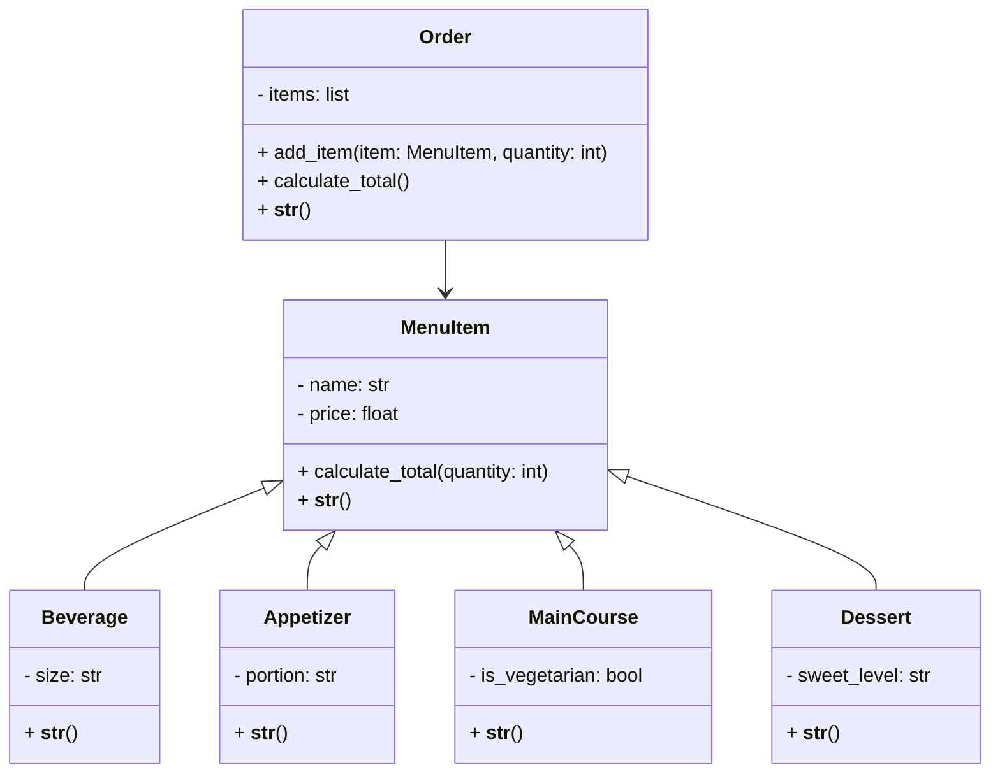

# Reto 3 POO
Para el tercer reto se llevan a cabo 3 actividades, la primera es modelar la clase de un rectángulo, luego la de una línea, y finalmente realizar el diagrama de clases y programación de un menú y la tarifa de cobro a un cliente.
***
## Logo del grupo


## Clase Rectángulo
Se incializa con 4 métodos distintos, dependiendo de la elección del usuario.
```python
def __init__(self, **kwargs):
        method = kwargs.get("method", "1")
        if method == "1":
            corner: Point = kwargs.get("corner", Point())
            self.width = kwargs.get("width", 1)
            self.height = kwargs.get("height", 1)
            self.center = Point((corner.x + self.width) / 2, (corner.y + self.height) / 2)
        elif method == "2":
            Center: Point = kwargs.get("center", Point())
            self.center = Center
            self.width =  kwargs.get("width", 1)
            self.height = kwargs.get("height", 1)
        elif method == "3":
            corner1: Point = kwargs.get("corner1", Point())
            corner2: Point = kwargs.get("corner2", Point())
            self.width = abs(corner2.x - corner1.x)
            self.height = abs(corner2.y - corner1.y)
            self.center = Point((corner1.x + corner2.x) / 2, (corner1.y + corner2.y) / 2)
        else:
            lines: list = kwargs.get("lines", [])
            self.width = lines[0].length
            self.height = lines[1].length
            self.center = Point(
                (lines[0].start.x + lines[0].end.x) / 2,
                (lines[0].start.y + lines[1].end.y) / 2
            )
```
Para el cálculo de su área y perimetro es simplemente acceder a los atributos del objeto y realizar la operación.
```python
def compute_area(self) -> float:
        area = self.width * self.height
        return area
    
    def compute_perimeter(self) -> float:
        perimeter = (self.width + self.height) * 2
        return perimeter
```
Para estas funciones lo que se hace es verificar que las coordenadas de un punto se encuentran entre los límites del rectángulo, entregando un booleano; en el caso de una línea se verifica si sus extremos se encuentran en el rectángulo, así si solo uno lo está, la línea lo atraviesa, si son los dos se encuentra contendia, y si no está ninguno la línea no pasa por el rectángulo.
```python
def compute_interference_point(self, point: Point) -> bool:
        left = self.center.x - self.width / 2
        right = self.center.x + self.width / 2
        bottom = self.center.y - self.height / 2
        top = self.center.y + self.height / 2
        if left <= point.x <= right and bottom <= point.y <= top:
            print(f"El punto ({point.x}, {point.y}) está dentro del rectángulo.")
            return True
        else:
            print(f"El punto ({point.x}, {point.y}) está fuera del rectángulo.")
            return False
    
    def compute_interference_line (self, line: "Line") -> None:
        # Check if either endpoint is inside the rectangle
        if self.compute_interference_point(line.start) and self.compute_interference_point(line.end):
            print("La línea está completamente dentro del rectángulo.")
        elif self.compute_interference_point(line.start) or self.compute_interference_point(line.end):
            print("La línea intersecta el rectángulo.")
        else:
            print("La línea está completamente fuera del rectángulo.")
```
Se crea una clase hija llamada "Cuadrado", la cual hereda todos los métodos de su clase padre, pero que al inicializarse utiliza la función padre cambiando que el ancho y largo son el mismo valor para el caso de un cuadrado.
```python
class Square(Rectangle):
    def __init__(self, side: float = 1, center: Point | None = None):
        if center is None:
            center = Point()
        super().__init__(method="2", width=side, height=side, center=center)

    def __str__(self) -> str:
        return f"Cuadrado centrado en ({self.center.x}, {self.center.y}) con lado {self.width}."
```
***
## Clase Línea
Se inicializa con dos puntos, uno al inicio y otro al final, luego guarda estos como atributos además de su pendiente y longitud, que calcula con las siguientes funciones.
```python
def __init__(self, start: Point, end: Point) -> None:
        self.start = start
        self.end = end
        self.length = self.compute_length()
        self.slope = self.compute_slope()
```
Simplemente llamando los atributos guardados se realizan los cálculos y se devuelven los resultados.
```python
    def compute_length(self) -> float:
        return self.start.compute_distance(self.end)

    def compute_slope(self) -> float:
        if self.end.x - self.start.x == 0:
            return float("inf")  # Pendiente infinita
        return (self.end.y - self.start.y) / (self.end.x - self.start.x)
```
Se despeja de la ecuación general de una recta para hallar los intersectos, pero en caso de que la pendiente sea 0 o infinta, se hace la salvedad al usuario.
```python
    def compute_horizontal_cross(self) -> float:
        if self.slope == 0:
            return float("inf")  # Línea horizontal, no cruza el eje x
        return self.start.y - self.slope * self.start.x
    
    def compute_vertical_cross(self) -> float:
        if self.slope == float("inf"):
            return float("inf")  # Línea vertical, no cruza el eje y
        return self.start.x - (self.start.y / self.slope)
```
***
## Escenario de Restaurante
En el diagrama de clases podemos ver la clase original "Orden", la cual contiene Items, que provienen de la clase "Menu Item" y que a la vez se divide en "Entradas", "Plato principal", "Bebidas" y "Postres", todos tienen función dunder str para imprimir objetos y todos tienen sus atributos únicos o compartidos cómo:
- Precio
- Porción
- Si es vegetariano

De manera específica, podemos ver en python las clases de la siguiente forma:
### Items del Menú
```python
class MenuItem:
    def __init__(self, name: str, price: float):
        self.name = name
        self.price = price

    def calculate_total(self, quantity: int = 1) -> float:
        return self.price * quantity

    def __str__(self) -> str:
        return f"{self.name} - ${self.price:,.0f} COP"
```
#### Sus clases hijas
```python

class Beverage(MenuItem):
    def __init__(self, name: str, price: float, size: str):
        super().__init__(name, price)
        self.size = size

    def __str__(self) -> str:
        return f"{self.name} ({self.size}) - ${self.price:,.0f} COP"


class Appetizer(MenuItem):
    def __init__(self, name: str, price: float, portion: str):
        super().__init__(name, price)
        self.portion = portion

    def __str__(self) -> str:
        return f"{self.name} [{self.portion}] - ${self.price:,.0f} COP"


class MainCourse(MenuItem):
    def __init__(self, name: str, price: float, is_vegetarian: bool = False):
        super().__init__(name, price)
        self.is_vegetarian = is_vegetarian

    def __str__(self) -> str:
        veg = " (Vegetariano)" if self.is_vegetarian else ""
        return f"{self.name}{veg} - ${self.price:,.0f} COP"


class Dessert(MenuItem):
    def __init__(self, name: str, price: float, sweet_level: str = "Medio"):
        super().__init__(name, price)
        self.sweet_level = sweet_level

    def __str__(self) -> str:
        return f"{self.name} [Dulzura: {self.sweet_level}] - ${self.price:,.0f} COP"
```
### Orden realizada
```python
class Order:
    def __init__(self):
        self.items: list[tuple[MenuItem, int]] = []

    def add_item(self, item: MenuItem, quantity: int = 1):
        self.items.append((item, quantity))

    def calculate_total(self) -> float:
        total = sum(item.calculate_total(qty) for item, qty in self.items)
        # Descuento: 10% si la orden supera 150.000 COP
        if total > 150000:
            total *= 0.9
        return total

    def __str__(self) -> str:
        details = "Orden del cliente:\n"
        for item, qty in self.items:
            details += f"{qty} x {item} = ${item.calculate_total(qty):,.0f} COP\n"
        details += f"TOTAL: ${self.calculate_total():,.0f} COP\n"
        return details
```
***
Finalmente, en la sección de archivos hay 2 programas para probar el código y hacer tus figuras y ordenes deseadas.
